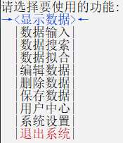
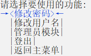

# 编译指南

- 强烈建议使用**Visaul Studio**打开解决方案, 从`Main`项目以**Debug**模式(*也就是默认的模式*)编译运行. 由于某些原因, `main()`函数与其他模块是分离的.
- `UnitTest`项目与程序本体无关, 若仅关注程序本体则**无需理会**.
- 特定文件的少量修改可能导致链接错误*(原因不明)*, 清空`.obj`文件重新构建可能解决问题.

# 程序介绍

## 基本操作方式: 

- 纯键盘, 鼠标操作未支持. 
- 菜单可以用`↑↓←→`, `Home`, `End` 和数字键定位, `Enter`确定.
- 需要输入数字时, 不能输入非数字的内容. 其他情况支持绝大部分字符, 包括数字, 字母和汉字.

## 登录界面

- 有 **登录**, **注册**, **退出** 三个选项. 若从未登陆, 则自动创建一个用户名为**Admin**, 密码为**123456**的管理员账号. 之后新注册的账号皆为普通用户.
- 登录/注册后进入**主菜单**.

## 主菜单

- 显示数据: 显示**当前**最新数据

- 数据输入: 输入若干**新的**多项式. 允许添加任意数目的多项式

- 数据搜索: 通过多项式的**名称**/**项数**搜索数据

- 数据拟合: 样本数据**生成**、样本数据的**查看**、根据样本**拟合**参数及拟合程度评价

- 编辑数据: 编辑指定编号的数据

- 删除数据: 删除指定编号的数据

- 保存数据: 在没有设定自动保存的情况下, 执行该项以**主动保存**数据

- 用户中心: 进入用户中心

  

  - 修改密码: 修改当前账号的**密码**
  - 修改用户名: 修改当前账号的**用户名**
  - 管理员模块: **仅管理员**可进入
    - 显示用户信息: 显示所有现存的用户的**基本信息**
    - 删除用户: 删除**指定用户**
  - 登出: **登出**当前账号, 回到登录界面

- 系统设置: 进入系统设置

  关于颜色设置: 当出现下图所示颜色条, 按`←→`选择需要设置的颜色, 按`Enter`确认.

  

  - 前景色: 设置字体颜色, 大部分输出**文本**将采用该色
  - 背景色: 设置背景颜色, 大部分输出文本的**背景**将采用该色
  - 自动保存: 是否在数据变动后自动保存.

## 数据存储

数据存储在程序的同一路径下.  `User.json` 、`Config.json`  与`*Data*.json`会在需要时自动生成.