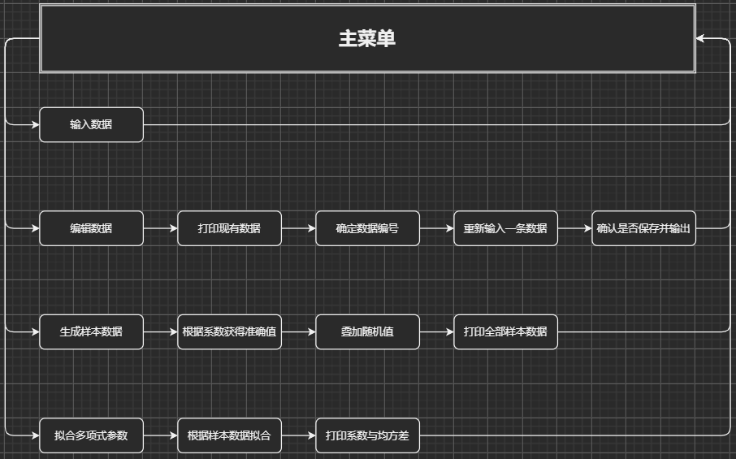

# 高级程序设计实践(c++): 多项式参数辨识(拟合)

*这里是还没有写好的封面*

[TOC]
## 课程设计基本要求

1. 编写多项式函数的参数辨识系统，多项式函数的形式为:

$y=a_0+a_1\cdot x+a_2\cdot x^2+...+a_n \cdot x^n$

式中，$x$为自变量（$x_{min} ≤ x ≤ x_{max}$），$y$为因变量，$a_0, a_1, a_2, …, a_n$为多项式的系数，$n$为多项式的次数。

2. 每个多项式包括以下信息：多项式名称（根据$n$的值命名，如2次多项式、3次多项式，……）、自变量的上限$x_{max}$和下限$x_{min}$，多项式的次数(即$n$的值)、多项式系数的真实值$a_0, a_1, a_2, …, a_n$、参数的辨识结果: $a'_0, a'_1, a'_2, …, a'_n$、辨识结果的评价指标
3. 系统主要功能为多项式参数的辨识和多项式数据的文件保存
4. 所设计的系统要求能用于多个用户, 每个用户管理自己的数据和登录密码

## 整体规划与分析

### 要求与设计分析

1. 多项式参数数目不定, 内存中优先使用`vector`保存数据, 硬盘中则采用json文本保存. 为此需要引入一个json库, 同时也能为其它数据的序列化提供一个容易操作的方法
2. 文件读写: 基于json文本保存, 直接从固定的相对路径存取文件
3. 每个用户独立管理自己的数据和登录密码: 需要一个用户类来管理具体数据文件路径, 由于同时只会有一个用户及其对应数据集, 因此只需要管理文件路径, 具体数据集可以由main函数定义
4. 多项式参数辨识: 需要一个辨识函数. 这里可以通过网上搜索一些数学资料得到, 甚至可能直接搜索到相关实现
5. 为学习哈希加密算法的应用, 用户密码使用hash密文保存, 以hash验证密码正确性. 由于不关注hash的具体实现, 需引入一个hash的实现库
6. 区分用户组和权限是一个相对庞大的工程, 在此仅区分Admin和Default两种不同的用户, Admin能访问比Default更多的功能. 用户权限需要保存, 在此顺势加上AES加密, 将权限用密码生成的密钥加密保存/读取
7. 默认的控制台程序都是黑底白字的框框, 纯文字排版不够美观, 引入一个自己调用WindowsAPI的控制台上色库, 简化输出彩色文本的流程, 界面可以更加丰富、美观
   - 文本前景色和背景色可以作为配置项保存(尽管允许修改, 实际输出的文本都是在白底黑字的基本配色下调整的, 其他配色视觉效果会差许多, 甚至伤眼)
8. 模仿一些应用(如较老的BIOS)的菜单实现一个可以用键盘控制的菜单, 使功能选择的过程更加人性化
   - 在实现菜单后, 基于7可以实现一个颜色选择器

### 类结构

如图, 其中*A--->B*表示*A依赖B*

- 主体结构

  

- ColorfulConsole

  

### 程序结构

如下图所示.


## 程序具体设计

### 数据存取

- json的应用: 借助github上[nlohmann的json库](https://github.com/nlohmann/json)进行序列化得到一个json格式的字符串
- 文件完整读取/完整写入: 利用`ifstream::seekg()`函数间接获取文件长度, 经过处理一次性读取文本文件的全部内容; 利用`ofstream::write()`函数直接写入一整个字符串
- 流程图略

### 多项式数据

- 增删查改四件套: 基于`std::vector`实现的动态数组, 通过`emplace_back()` `push_back()`等函数对数组进行访问, 简化了内存管理的操作. 

- 多项式取值: 实现了一个`GetPolyFuncValue()`函数, 能够根据每一项系数和输入的x计算出一个y值.

- 多项式样本数据生成: 在准确值的基础上叠加-0.5~0.5的随机值, 得到一个样本数据. 执行50次, 得到50组随机数据

- 多项式系数拟合: 借助[natedomain的polyfit](https://github.com/natedomin/polyfit)进行多项式拟合

- 相关流程图如下

  

### 用户数据

- 登录: 输入用户名与密码登录. 初始状态下有且仅有一个`Admin`账户, 密码为`123456`, 密码通过验证则进入系统

- 注册: 输入新的用户名与密码注册, 注册后进入系统

- 所有用户都可修改自己的用户名与密码

- 管理员可以查看现有所有用户的基本信息, 及删除用户. 原计划有更多的功能, 但是需求中并未提及, 因此没有实现

- 密码: 仅保存密码的hash字符串

- 用户权限: 较短的字符串, 将密码进行一系列处理后得到一个密钥, 以该密钥经过AES加密后保存; 读取权限信息时根据用相同操作获取密钥进行解密

- 相关流程图如下

  

### 设置数据

- 前景色: 普通字体的前景色
- 背景色: 普通字体的背景色
- 自动保存: 是否在每次编辑数据后自动保存到文件中

### 彩色文本

- 最基本的实现: 获取窗口句柄, 通过`SetConsoleTextAttribute()`传入目标颜色属性所对应的整数, 达到修改文本颜色的目的. 下文中的代码将其封装为一个函数:

  ```c++
  #include <Windows.h>
  #include "TextAttrSetter.h"
  
  namespace ColorfulConsole
  {
  	HANDLE TextAttrSetter::StdHandle = GetStdHandle(STD_OUTPUT_HANDLE);
  	void TextAttrSetter::SetAttr(WORD rawAttr)
  	{
  		SetConsoleTextAttribute(StdHandle, rawAttr);
  	}
  }
  ```

- 文本属性为32位整型, 1~4位代表前景色, 5~8位代表背景色, 其余位的属性暂时不关注. 可见, 这样的属性是非常抽象的, 且其操作涉及许多位运算, 容易引发错误. 因此编写了一个`WarpedTextAttr`类来对各个位赋予具体含义, 能够通过数据成员分别设置各个二进制位的真假, 降低了后续操作的抽象程度和出错概率.

- 为`WarpedTextAttr`编写运算符重载, 使其能够借助标准输出流来简化颜色修改的过程, 使用方法如下

  ```c++
  //WTA = WarpedTextAttr, WTA::LIGHTBLUE为一个WTA类型的公开的静态常对象
  std::cout << WTA::LIGHTBLUE << "B" << WTA::LIGHTGREEN << "G" << WTA::LIGHTRED << "R" << WTA::WHITE << std::endl;
  ```

  输出: 

- 由于设置颜色时, 前景色和背景色是同时设置的, 有时仅对前景色感兴趣, 却不得不先设法获取最近的背景色以达到理想效果. 因此, 编写了`GlobalEnvironment`类在全局保存一个当前通用前景/背景色. 再加上`ForeColorProxy`类将背景色的获取和使用封装起来, 其他代码只需关注需要设置的前景色. 类似的还有`BackColorProxy` , 只是把外部接口改为背景色. 这样, 通过`GlobalEnvironment`设置好文本属性后, 可以只对前景色或背景色修改, 两者在外部看来是分离的.

- 每一次颜色修改都要产生/获取一个WTA对象, 这无形中增加了代码量, 或者产生较长的文本输出语句. 为了解决这个问题, 设计了一个"颜色转义"机制: 在原字符串中加入若干"颜色转义符", 传入特定对象(`ColorEscString::ces`), 输出后可以根据"颜色转义符"修改对应文本的颜色.

  - 使用效果: 一行`cout << ces << "&9B&aG&cR&f\n";`可以达到与上文"BGR"相同的效果, 其中`&9`代表蓝色, 其他"&"开头的两个字符含义类似

  - 实现方法: 见流程图

    

### 菜单系统

- 通过键盘操作定位菜单项

- 高亮选中的菜单

- 返回最终确定的菜单索引

- 宏观流程图:

  

### 基本输入输出

- 函数`YesNoQuery`打印出一个简单对话框, 键盘控制, 按回车确定则返回true, 否则返回false

- 函数`CheckedInput_int`从用户获取一个int型数字输入, 若出现下列情况之一:

  - 非int型数据
  - 参数中函数校验返回结果为false

  则输出错误提示, 并等待下一个输入. 这里校验函数来自于`std::function<bool(int)>`类型的参数, 可传入lambda函数或函数指针

- 形如`SaveInput_xxx`的一系列函数, 仅获取对应类型的输入, 否则提示数据无效, 并等待下一个输入

## 程序运行过程

## 软件特色与不足

## 设计体会

## 参考文献

